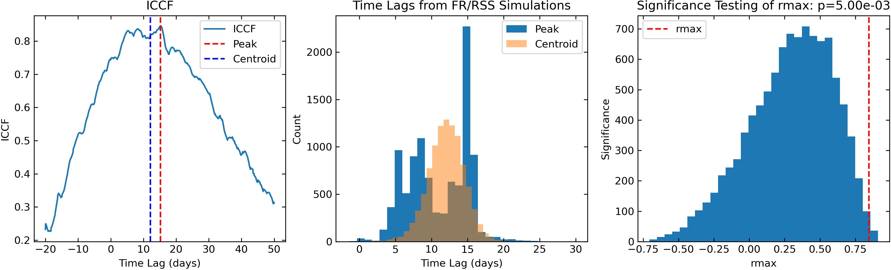
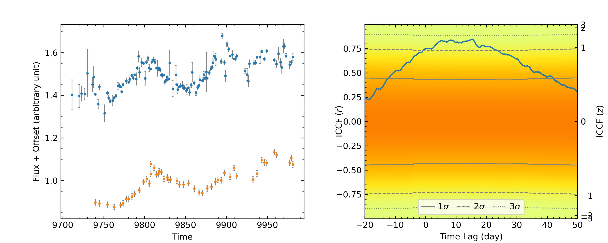

.. _ccf_label:

Interpolated Cross Correlation Function
=======================================

Mathematical Definition
-----------------------

The cross-correlation function between two light curves, say, :math:`x(t)` and :math:`y(t)`, is defined as
(e.g., Li & Wang 2026)

.. math::

    r(\tau) = \frac{E\{[x(t)-\bar{x}][y(t+\tau)-\bar{y}]\}}
    {\sqrt{E\{[x(t)-\bar{x}]^2\}E\{[y(t+\tau)-\bar{y}]^2\}}},

where :math:`\tau` is the time lag, :math:`\bar{x}` and :math:`\bar{y}` are the mean values 
of :math:`x(t)` and :math:`y(t+\tau)`, respectively, and :math:`E\{x\}` is the expected value of :math:`x(t)`.

The realistic light curves in AGN monitoring are usually irregularly sampled and their observing cadences
are also not contemporaneous. Direct calculation of the CCF for AGN light curves is not straightforward. 
Interpolated cross-correlation function (ICCF) is then introduced to cope with irregular sampling.

For the convention, two rounds of cross-correlation coefficients are computed, with only one light curve 
being interpolated in each round. The final cross-correlation coefficient is
then assigned as the average of the two rounds.  Specifically, given a time lag :math:`\tau`, 
firstly shift :math:`x(t)` in time with :math:`\tau` and extract the segment in :math:`x(t+\tau)`
overlapping with :math:`y(t)`, which we denote :math:`x'(t)`. Then interpolate :math:`y(t)` onto the time 
points same as :math:`x'(t)`.
As such, we obtain two light curves :math:`x'(t)` and :math:`y'(t)` with the same duration and sampling rate.
We then directly compute their cross-correlation coefficient as below.
The second round repeats the same procedure but shifts :math:`y(t)` in time with :math:`\tau` and implements 
interpolation on :math:`x(t)`.

After interpolation, the cross-correlation coefficient of the light-curve pairs :math:`x'(t)` and :math:`y'(t)` 
is then calculated as 

.. math::

   r(\tau) = \frac{\sum_{i=1}^{n} (x'_i-\bar x')(y'_i-\bar y')}{\sqrt{\sum_{i=1}^n(x'_i-\bar x')^2\sum_{i=1}^{n}(y'_i-\bar y')^2}},

where $n$ is the number of points in the light curves,

.. math::

   \bar x' = \frac{1}{n}\sum_{i=1}^{n}x'_i,

and

.. math::

   \bar y' = \frac{1}{n}\sum_{i=1}^{n}y'_i.

The linear interpolation is used in calculating ICCF. This implementation follows the interpolated cross-correlation method introduced for AGN light curves by Gaskell & Sparke (1986) and further discussed by Peterson et al. (1998).

Null-Hypothesis Testing of ICCF
-------------------------------

There are two ways to test the significance of the ICCF peak. The first is 
to generate mock light curves  and then compute the significance level 
of the ICCF peak from the observed data. This is implemented in the 
function ``iccf_peak_significance``. 

The second way is to estimate the standard deviations of the ICCF following 
the procedure developed by Li & Wang (2026). This is implemented in the function 
``iccf_sigma_null``.

PyAT Implementation
---------------------

PyAT provides the following functions to calculate ICCF:

.. function:: iccf(t1, f1, t2, f2, ntau, tau_beg, tau_end, threshold=0.8, mode="multiple", ignore_warnings=False, ways=0)

    :synopsis: Calculate interpolated cross-correlation function (ICCF) between two light curves and determine the peak coefficient and time lag and centroid time lag.

    :param t1: Time array of the first light curve.
    :param f1: Flux array of the first light curve.
    :param t2: Time array of the second light curve.
    :param f2: Flux array of the second light curve.
    :param ntau: Number of time-lag bins to calculate the CCF.
    :param tau_beg: Beginning time lag to calculate the CCF.
    :param tau_end: End time lag to calculate the CCF.
    :param threshold: Threshold to filter out the CCF.
    :param mode: Mode to calculate the CCF, "multiple" or "single".
    :param ignore_warnings: Whether to ignore warnings.
    :param ways: Ways to calculate the CCF, 0: two ways; 1: only interpolate the first light curve; 2: only interpolate the second light curve.

    :return: ``tau``, ``ccf``, ``rmax``, ``tau_peak``, ``tau_cent``
     
              ``tau`` is the array of time-lag values, and ``ccf`` is the
              corresponding ICCF coefficient at each lag. ``rmax`` is the
              maximum ICCF coefficient. ``tau_peak`` is the lag at which the
              maximum occurs, and ``tau_cent`` is the centroid lag of the
              ICCF values above ``threshold``.
    :rtype: numpy.ndarray, numpy.ndarray, float, float, float

.. function:: iccf_mc(t1, f1, e1, t2, f2, e2, ntau, tau_beg, tau_end, nsim=1000, threshold=0.8, mode="multiple", ignore_warnings=False, ways=0)

    :synopsis: Monte Carlo simulation of interpolated cross-correlation function (ICCF) between two light curves
               using the FR/RSS method (Peterson et al. 1998).

    :param t1: Time array of the first light curve.
    :param f1: Flux array of the first light curve.
    :param e1: Error array of the first light curve.
    :param t2: Time array of the second light curve.
    :param f2: Flux array of the second light curve.
    :param e2: Error array of the second light curve.
    :param ntau: Number of time-lag bins to calculate the CCF.
    :param tau_beg: Beginning time lag to calculate the CCF.
    :param tau_end: End time lag to calculate the CCF.
    :param nsim: Number of Monte Carlo simulations to calculate the CCF, default is 1000.
    :param threshold: Threshold to filter out the CCF, default is 0.8.
    :param mode: Mode to calculate the CCF, "multiple" or "single".
    :param ignore_warnings: Whether to ignore warnings.
    :param ways: Ways to calculate the CCF, 0: two ways; 1: only interpolate the first light curve; 2: only interpolate the second light curve.

    :return: ``ccf_peak_mc``, ``tau_peak_mc``, ``tau_cent_mc``
              
              ``ccf_peak_mc`` contains the maximum ICCF coefficient from each
              simulation. ``tau_peak_mc`` contains the corresponding peak lag
              from each simulation, and ``tau_cent_mc`` contains the
              corresponding centroid lag from each simulation.
    :rtype: numpy.ndarray, numpy.ndarray, numpy.ndarray

.. function:: iccf_peak(t1, f1, t2, f2, ntau, tau_beg, tau_end)
    
    :synopsis: Calculate interpolated cross-correlation function (ICCF) between two light curves 
               and only determine the peak coefficient and time lag.

    :param t1: Time array of the first light curve.
    :param f1: Flux array of the first light curve.
    :param t2: Time array of the second light curve.
    :param f2: Flux array of the second light curve.
    :param ntau: Number of time-lag bins to calculate the CCF.
    :param tau_beg: Beginning time lag to calculate the CCF.
    :param tau_end: End time lag to calculate the CCF.
    :return: ``tau`` is the array of time-lag values, and ``ccf`` is the
              corresponding ICCF coefficient at each lag. ``rmax`` is the
              maximum ICCF coefficient, and ``tau_peak`` is the lag at which
              that maximum occurs.
    :rtype: numpy.ndarray, numpy.ndarray, float, float

.. function:: iccf_peak_significance(t1, f1, e1, t2, f2, e2, ntau, tau_beg, tau_end, nsim=1000, ways=0, doshow=False)

    :synopsis: Significance testing of the iccf peak, that is, computing the probability
               for iccf peaks of mock light-curve pairs exceeding the iccf peak of input 
               light curves. The input light curve pairs are delineated by separated random walk models,
               from which the mock light curves are generated. 
               The mock light curves are assumed to be fully random and uncorrelated. 

    :param t1: Time array of the first light curve.
    :param f1: Flux array of the first light curve.
    :param e1: Error array of the first light curve.
    :param t2: Time array of the second light curve.
    :param f2: Flux array of the second light curve.
    :param e2: Error array of the second light curve.
    :param ntau: Number of time-lag bins to calculate the CCF.
    :param tau_beg: Beginning time lag to calculate the CCF.
    :param tau_end: End time lag to calculate the CCF.
    :param nsim: Number of Monte Carlo simulations to calculate the CCF, default is 1000.
    :param ways: Ways to calculate the CCF, 0: two ways; 1: only interpolate the first light curve; 2: only interpolate the second light curve.
    :param doshow: Whether to show the histogram of iccf peaks of mock light-curve pairs, default is False.

    :return: ``prob``, ``rmax_sim``
            
              ``prob`` is the fraction of simulated ICCF peaks that exceed the
              peak measured from the input light curves. ``rmax_sim`` contains
              the maximum ICCF coefficient from each simulated light-curve
              pair.
    :rtype: float, numpy.ndarray
    

.. function:: iccf_sigma_null(t1, f1, e1, t2, f2, e2, ntau, tau_beg, tau_end, gapx=None, gapy=None, doshow=False)

    :synopsis: Estimate the standard deviations of the ICCF following the procedure developed by Li & Wang (2026).

    :param t1: Time array of the first light curve.
    :param f1: Flux array of the first light curve.
    :param e1: Error array of the first light curve.
    :param t2: Time array of the second light curve.
    :param f2: Flux array of the second light curve.
    :param e2: Error array of the second light curve.
    :param ntau: Number of time-lag bins to calculate the CCF.
    :param tau_beg: Beginning time lag to calculate the CCF.
    :param tau_end: End time lag to calculate the CCF.
    :param gapx: Gaps in the first light curve. A list of time periods like [[t1, t2], [t3, t3]]. Default is None.
    :param gapy: Gaps in the second light curve. A list of time periods like [[t1, t2], [t3, t3]]. Default is None.
    :param doshow: Whether to plot the results, default is False.

    :return: ``tau``, ``sigma_null``, ``fig`` (if doshow=True)

             ``tau`` is an array containing the time lags, and ``sigma_null`` 
             is an array containing the standard deviations of
             the ICCF at each time lag. ``fig`` is the matplotlib figure object.
    :rtype: numpy.ndarrays, numpy.ndarrays, matplotlib.figure.Figure (if doshow=True)

Examples
--------
First import PyAT in a Python script as follows:

.. code-block:: python

    import pyat

Then load the light curve data, e.g., take two light curves with file names of "lc1.txt" and "lc2.txt"
respectively:

.. code-block:: python

    import numpy as np

    lc1 = np.loadtxt("lc1.txt")
    lc2 = np.loadtxt("lc2.txt")

Here, the file contains three columns, namely time, flux, and error. Two examplary light curves 
extracted from Li et al. (2024) are provided in the subfolder `test` in the package.

Now calculate the ICCF between the two light curves:

.. code-block:: python
    
    import pyat 

    ntau = 1001
    tau_beg = -50.0
    tau_end = 100.0
    threshold = 0.8
    mode = "multiple"
    ignore_warning = False

    # calculate iccf
    t, r, rmax, tau_peak, tau_cent = pyat.iccf(lc1[:, 0], lc1[:, 1], lc2[:, 0], lc2[:, 1], 
                                           ntau, tau_beg, tau_end)
    print("rmax, tau_peak, tau_cent: %.2f, %.2f, %.2f" % (rmax, tau_peak, tau_cent))
    
    # peroform Monte Carlo simulation to determine the time lag uncertainties
    nsim = 10000
    ccf_peak_mc, tau_peak_mc, tau_cent_mc = pyat.iccf_mc(lc1[:, 0], lc1[:, 1], lc1[:, 2], 
                                                        lc2[:, 0], lc2[:, 1], lc2[:, 2], ntau, tau_beg, tau_end, nsim=nsim, threshold=threshold, 
                                                        mode=mode, ignore_warning=ignore_warning)

    # perform significance testing of the iccf peak
    prob, rmax_sim = pyat.iccf_peak_significance(lc1[:, 0], lc1[:, 1], lc1[:, 2], 
                                                lc2[:, 0], lc2[:, 1], lc2[:, 2], 
                                                ntau, tau_beg, tau_end, nsim=10000, 
                                                doshow=True)

The uncertainties of the time lags can be estimated from the Monte Carlo simulations. 
For example, the 68% confidence intervals of the peak and centroid time lags can 
be calculated as follows:

.. code-block:: python

    tau_peak_err = np.percentile(tau_peak_mc, [15.85, 84.15])
    tau_cent_err = np.percentile(tau_cent_mc, [15.85, 84.15])
    print("Peak ICCF:", rmax)
    print("Peak time lag: {:.2f} +{:.2f} -{:.2f}".format(tau_peak, tau_peak_err[1]-tau_peak, tau_peak-tau_peak_err[0]))
    print("Centroid time lag: {:.2f} +{:.2f} -{:.2f}".format(tau_cent, tau_cent_err[1]-tau_cent, tau_cent-tau_cent_err[0]))

Now plot the results and generate figures.

.. code-block:: python

    import matplotlib.pyplot as plt

    # plot the ICCF
    plt.rcParams["xtick.direction"] = "in"
    plt.rcParams["ytick.direction"] = "in"
    plt.rcParams["xtick.top"] = True
    plt.rcParams["ytick.right"] = True

    fig = plt.figure(figsize=(15, 4))
    ax = fig.add_subplot(131)
    plt.plot(tau, ccf, label="ICCF")
    ax.axvline(x=tau_peak, color="red", label="Peak", ls='--')
    ax.axvline(x=tau_cent, color="blue", label="Centroid", ls='--')
    ax.set_xlabel("Time Lag (days)")
    ax.set_ylabel("ICCF")
    ax.legend()
    ax.set_title("ICCF")

    # plot histogram of time lags from FR/RSSMonte Carlo simulations
    ax = fig.add_subplot(132)
    ax.hist(tau_peak_mc, label="Peak", bins=30)
    ax.hist(tau_cent_mc, label="Centroid", alpha=0.5, bins=30)
    ax.legend()
    ax.set_ylabel("Count")
    ax.set_xlabel("Time Lag (days)")
    ax.set_title("Time Lags from FR/RSS Simulations")

    # plot the significance testing result
    ax = fig.add_subplot(133)
    ax.hist(rmax_sim, bins=30)
    ax.set_xlabel("rmax")
    ax.set_ylabel("Significance")
    ax.axvline(x=rmax, color="red", label="rmax", ls='--')
    ax.legend()
    ax.set_title("Significance Testing of rmax: p={:.2e}".format(prob))
    plt.show()  

The output figure is as follows. 

    The ICCF, the distributions of peak and centroid time lags from FR/RSS Monte Carlo simulations,
    and the significance testing result of rmax.

The Null-hypothesis testing using the method in Li & Wang (2026) is implemented as follows.

.. code-block:: python

    # null test using the method in Li & Wang 2026
    tau, sigma, fig_sigma = pyat.iccf_sigma_null(lc1[:, 0], lc1[:, 1], lc1[:, 2], 
                        lc2[:, 0], lc2[:, 1], lc2[:, 2], 
                        ntau, tau_beg, tau_end, gapx=None, gapy=None, 
                        doshow=True)
    fig_sigma.savefig("sigma_null.jpg", dpi=300)

The output figure is as follows.

    The null-hypothesis testing result of the ICCF using the method in Li & Wang (2026).

References
----------
- `Gaskell, C. M., & Peterson, B. M. 1987, ApJS, 65, 1 <https://ui.adsabs.harvard.edu/abs/1987ApJS...65....1G/abstract>`_, 
  *The Accuracy of Cross-Correlation Estimates of Quasar Emission-Line Region Sizes*
- `Peterson, B. M., Wanders, I., Horne, K., et al. 1998, PASP, 110, 660 <https://ui.adsabs.harvard.edu/abs/1998PASP..110..660P/abstract>`_, 
  *On Uncertainties in Cross‐Correlation Lags and the Reality of Wavelength‐dependent Continuum Lags in Active Galactic Nuclei*
- `Li, Y.-R. & Wang, J.-M., 2026, ApJ, in press <http://arxiv.org/abs/2609.19672>`_, 
  *On the Probability Distribution and Null-hypothesis Testing of Cross-correlation for Light Curves in Active Galactic Nuclei*
- `Li, Y.-R. et al. 2024, ApJ, 974, 85 <https://ui.adsabs.harvard.edu/abs/2024ApJ...974...86L/abstract>`_, 
  *Spectroastrometry and Reverberation Mapping of 
  Active Galactic Nuclei. I. The Hβ  Broad-line Region Structure and Black Hole Masses of Five Quasars*