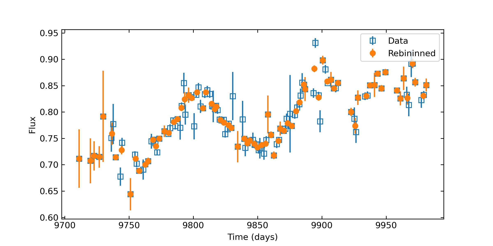

.. _lc_rebin_label:

Light-curve Rebinning
=====================

PyAT Implementation
-------------------

PyAT provides a procedure to rebin light curves using the inverse variance weighting, namely, 
for rebin flux and error in each time bin is 

.. math:: 
    f_{\rm reb} = \frac{1}{\sum_{i} \frac{1}{e_i^2}} \sum_{i} f_i \frac{1}{e_i^2}

    e_{\rm reb} = \frac{1}{\sum_{i} \frac{1}{e_i^2}} \sqrt{\sum_{i} \frac{1}{e_i^2}}

where ``f`` is the flux array and ``e`` is the error array.

The procedure is implemented in the function ``rebin``.

.. function:: rebin(t, f, e, tb)

    :annotation: numpy.ndarray, numpy.ndarray, numpy.ndarray, float -> numpy.ndarray, numpy.ndarray, numpy.ndarray
    :synopsis: Rebin light curves using the inverse variance weighting.
    
    :param t: Time array of the light curve.
    :param f: Flux array of the light curve.
    :param e: Error array of the light curve.
    :param tb: Target bin size.
    :return: ``t``, ``f``, ``e``.
            
            ``t`` is an array containing the rebinned time points.
            ``f`` is an array containing the rebinned flux values.
            ``e`` is an array containing the rebinned error values.
    :rtype: numpy.ndarray, numpy.ndarray, numpy.ndarray

Examples
--------

.. code-block:: python

    import numpy as np
    from pyat import rebin
    import matplotlib.pyplot as plt

    lc = np.loadtxt("lc1.txt")

    t, f, e = rebin(lc[:, 0], lc[:, 1], lc[:, 2], 2)

    # Plot the rebinned light curve
    fig = plt.figure(figsize=(8, 4))
    plt.errorbar(lc[:, 0], lc[:, 1], lc[:, 2], ls="none", marker="s", fillstyle="none", label='Data')
    plt.errorbar(t, f, e, ls="none", marker="o", fillstyle="full", label='Rebininned')
    plt.legend()
    plt.xlabel("Time (days)")
    plt.ylabel("Flux")
    plt.show()
    fig.savefig("lc_rebin.jpg", dpi=300)
    plt.close()

The output file is 

    Light-curve rebinning.
   