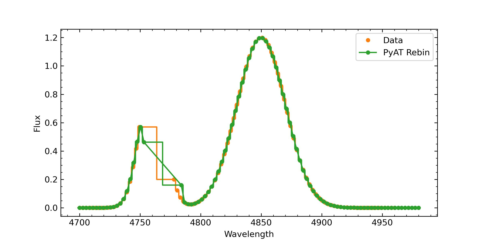
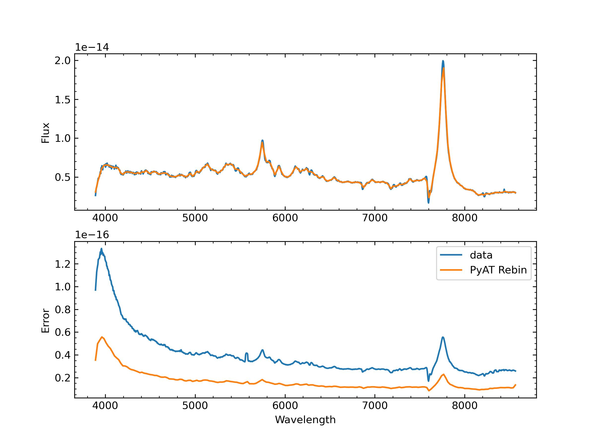

.. _spec_rebin:

Spectrum Rebinning
=====================

PyAT Implementation
-------------------

PyAT provides procedures to rebin a spectrum onto a new wavelength grid while
keeping the total flux unchanged. The spectrum is treated as piecewise constant
over the input wavelength bins, and the value in each new bin is the
flux-conserving (area-weighted) average of the overlapping input pixels.

Given a new bin of width :math:`W` that overlaps with input pixels
:math:`i = 1, \dots, n` over partial widths :math:`w_i` (with
:math:`\sum_{i} w_i = W`), the rebinned flux is

.. math::

    f_{\rm reb} = \frac{1}{W} \sum_{i} w_i f_i,

where :math:`f_i` is the flux of the :math:`i`-th input pixel. When the errors
of the input pixels are independent, the error of the rebinned flux is
propagated as

.. math::

    e_{\rm reb} = \frac{1}{W} \sqrt{\sum_{i} w_i^2 e_i^2},

where :math:`e_i` is the error of the :math:`i`-th input pixel.

The wavelength bins are constructed from pixel centers: the interior edges are
placed at the midpoints between adjacent pixels, while the two outermost edges
are extrapolated by half a pixel width. New bins extending beyond the
wavelength range of the input spectrum are filled with the nearest edge pixel
value (constant extrapolation); the integrated flux is therefore conserved only
over the overlapping range.

The procedures are implemented in the functions ``get_bin_edge``,
``rebin_spectrum``, and ``rebin_spectrum_with_error``.

.. function:: get_bin_edge(wave)

    :annotation: numpy.ndarray -> numpy.ndarray
    :synopsis: Get the bin edges of an input wavelength grid.

    :param wave: Wavelength array of pixel centers. Must be strictly
                 increasing and contain at least two elements.
    :return: Wavelength bin edges, with interior edges at the midpoints
             between adjacent pixels and the two outermost edges
             extrapolated by half a pixel width.
    :rtype: numpy.ndarray

.. function:: rebin_spectrum(wave_rebin, wave, prof)

    :annotation: numpy.ndarray, numpy.ndarray, numpy.ndarray -> numpy.ndarray
    :synopsis: Rebin a spectrum to an input wavelength grid, keeping the total flux unchanged.

    :param wave_rebin: Wavelength array of pixel centers to rebin to. Must be
                       strictly increasing and contain at least two elements.
    :param wave: Wavelength array of pixel centers. Must be strictly
                 increasing and contain at least two elements.
    :param prof: Spectrum array, must have the same length as ``wave``.
    :return: ``prof_rebin``.
            
            ``prof_rebin`` is an array containing the rebinned spectrum.
    :rtype: numpy.ndarray

.. function:: rebin_spectrum_with_error(wave_rebin, wave, prof, error)

    :annotation: numpy.ndarray, numpy.ndarray, numpy.ndarray, numpy.ndarray -> numpy.ndarray, numpy.ndarray
    :synopsis: Rebin a spectrum to an input wavelength grid, propagating the errors.

    :param wave_rebin: Wavelength array of pixel centers to rebin to. Must be
                       strictly increasing and contain at least two elements.
    :param wave: Wavelength array of pixel centers. Must be strictly
                 increasing and contain at least two elements.
    :param prof: Spectrum array, must have the same length as ``wave``.
    :param error: Error array of the spectrum, must have the same length as
                  ``wave``.
    :return: ``prof_rebin``, ``error_rebin``.
            
            ``prof_rebin`` is an array containing the rebinned spectrum.
            ``error_rebin`` is an array containing the propagated error of
            the rebinned spectrum.
    :rtype: numpy.ndarray, numpy.ndarray

Examples
--------

Here is an example of spectrum rebinning without considering the errors.

.. code-block:: python

    import numpy as np
    from pyat.rebin_spectrum import rebin_spectrum, get_bin_edge
    import matplotlib.pyplot as plt

    # construct a spectrum with two Gaussian components
    wave = np.linspace(4700, 4960.0, 101)
    flux = 1.2*np.exp(-0.5*(wave - 4850.0)**2/20.0**2) \
           + np.exp(-0.5*(wave - 4760.0)**2/10.0**2)

    # remove a segment to mimic a gap in the spectrum
    wave = np.delete(wave, np.arange(20, 30))
    flux = np.delete(flux, np.arange(20, 30))

    # rebin onto a new (irregular) wavelength grid
    wave_rebin = np.linspace(4700, 4980.0, 101)
    wave_rebin = np.delete(wave_rebin, np.arange(20, 30))
    flux_rebin = rebin_spectrum(wave_rebin, wave, flux)

    # plot the original and rebinned spectra
    fig = plt.figure(figsize=(8, 4))
    ax = fig.add_subplot(111)
    # data
    wave_edge = get_bin_edge(wave)
    x = np.array(list(zip(wave_edge[:-1], wave_edge[1:]))).flatten()
    y = np.array(list(zip(flux, flux))).flatten()
    ax.plot(x, y, color="C1")
    ax.plot(wave, flux, marker='o', label='Data', ls='none', color="C1", markersize=4)

    # rebin
    wave_rebin_edge = get_bin_edge(wave_rebin)
    x = np.array(list(zip(wave_rebin_edge[:-1], wave_rebin_edge[1:]))).flatten()
    y = np.array(list(zip(flux_rebin, flux_rebin))).flatten()
    ax.plot(x, y, color='C2')
    ax.plot(wave_rebin, flux_rebin, marker='o', label='PyAT Rebin', color="C2", markersize=4)

    ax.set_xlabel("Wavelength")
    ax.set_ylabel("Flux")
    ax.legend()
    ax.minorticks_on()
    plt.show()

The output file is

    Spectrum rebinning.

Here is an example of spectrum rebinning with considering the errors.

.. code-block:: python

    import numpy as np
    from pyat.rebin_spectrum import rebin_spectrum_with_error, get_bin_edge
    import matplotlib.pyplot as plt

    wave, flux, err = np.loadtxt("spectrum_example.txt", usecols=(0,1,2), unpack=True)

    wave_rebin = np.linspace(wave[0], wave[-1], 200)
    flux_rebin, err_rebin = rebin_spectrum_with_error(wave_rebin, wave, flux, err)
    
    fig = plt.figure(figsize=(8, 6))
    ax = fig.add_subplot(211)
    plt.plot(wave, flux)
    plt.plot(wave_rebin, flux_rebin)
    ax.set_ylabel("Flux")
    ax.minorticks_on()

    ax = fig.add_subplot(212)
    plt.plot(wave, err, label='data')
    plt.plot(wave_rebin, err_rebin, label='PyAT Rebin')
    ax.minorticks_on()
    ax.legend()
    ax.set_ylabel("Error")
    ax.set_xlabel("Wavelength")
    plt.show()

The output file is

    Spectrum rebinning with errors.
    